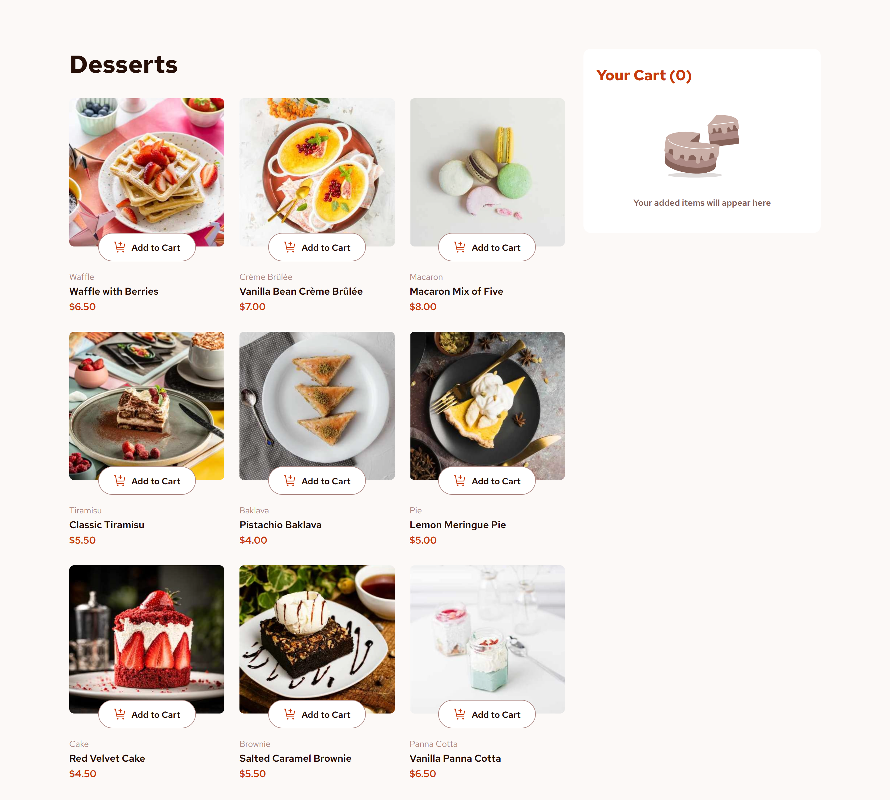

# Frontend Mentor - Product list with cart solution

This is a solution to the [Product list with cart challenge on Frontend Mentor](https://www.frontendmentor.io/challenges/product-list-with-cart-5MmqLVAp_d). Frontend Mentor challenges help you improve your coding skills by building realistic projects. 

## Table of contents

- [Overview](#overview)
  - [The challenge](#the-challenge)
  - [Screenshot](#screenshot)
  - [Links](#links)
- [My process](#my-process)
  - [Built with](#built-with)
  - [What I learned](#what-i-learned)
- [Author](#author)

## Overview

### The challenge

Users should be able to:

- Add items to the cart and remove them
- Increase/decrease the number of items in the cart
- See an order confirmation modal when they click "Confirm Order"
- Reset their selections when they click "Start New Order"
- View the optimal layout for the interface depending on their device's screen size
- See hover and focus states for all interactive elements on the page

### Screenshot



### Links

- [Solution URL](https://github.com/Kking927/product-list-with-cart)
- [Live Site URL](https://kking927.github.io/product-list-with-cart/)

## My process

### Built with

- Semantic HTML5 markup
- CSS custom properties
- Flexbox
- CSS Grid
- Mobile-first workflow
- Vanilla JavaScript (ES6+)

### What I learned

During this project, I strengthened my CSS Grid layout techniques. Beyond styling, a major focus was improving my vanilla JavaScript logic for state management:

```js
// Example of handling dynamic cart quantity and price calculations
const updateCartItemTotal = (item) => {
    return item.quantity * item.price;
};
```

## Author

- Frontend Mentor - [@Kking927](https://www.frontendmentor.io/profile/Kking927)
- GitHub - [Kking927](https://github.com/Kking927)
